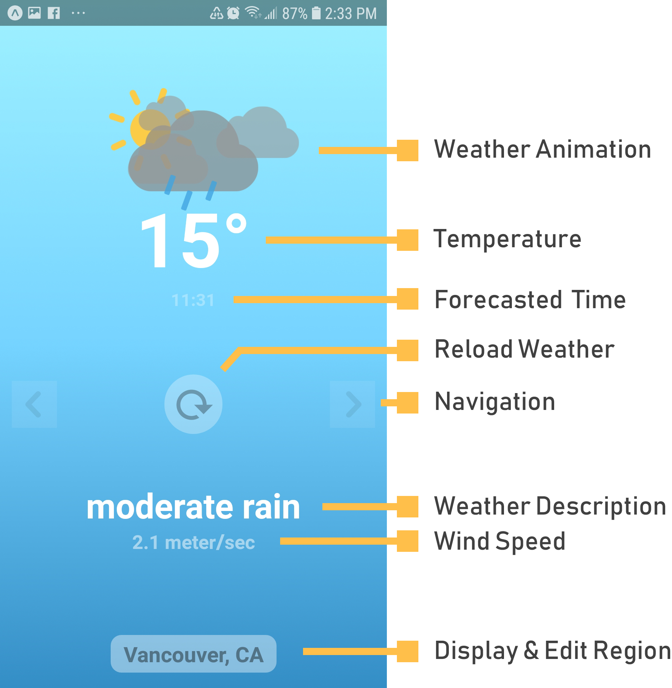

# react-native-weather
Learning React Native by Building a Simple Weather App

* **weather scene**
  

* **map scene** - adding new region
  

* [demo video](https://youtu.be/gbH2cuuUjHc)  

## Table of contents

* [Setup](#setup)
* [Build](#build)
* [APIs](#apis)
* [License](#license)

---  

## Setup from scratch
* Install Expo CLI
```bash
~$ npm install -g expo-cli
~$ expo init weather-app
```
* Create a new repository on github  

* Connect weather-app to git repository
```bash
~$ git remote add origin https://github.com/jaeyp/react-native-weather  
~$ git pull origin master --allow-unrelated-histories  
```

* Install Expo Location API
```bash
~$ expo install expo-location
```

* Install axios (Promise based HTTP client)
```bash
~$ yarn add axios
```

* Install prop-types
```bash
~$ yarn add prop-types
```

* Animation
```bash
~$ yarn add react-native-animatable
```

* Styles
```bash
~$ expo install expo-linear-gradient
```

* ~~Navigation~~
```bash
~$ npm install react-navigation
~$ npm install react-navigation-stack
```

* ~~Gesture~~
```bash
~$ yarn add react-native-gesture-handler@~1.3.0 # v1.3.0 required
or
~$ expo install react-native-gesture-handler
```

* MapView
```bash
~$ expo install react-native-maps
```

* ~~Google map geocoding~~
```bash
~$ yarn add react-native-geocoding
```

---  

## Setup
* Clone project
```bash
~$ git clone https://github.com/jaeyp/react-native-weather
```

* Install packages
```bash
~$ yarn install
```

---  

## Build
* android
```bash
~$ expo start
~$ expo build:android
```

* ios  
```bash
# ios-build has never been tested, you might see some issues to solve.
~$ expo start
~$ expo build:ios
```

---  

## Run the app
```bash
~$ yarn start
```

---  

## APIs
* [Google Maps APIs](https://cloud.google.com/maps-platform/)  
* [Open Weather APIs](https://openweathermap.org/)  

---  

### License

MIT © [Jaehyun Park](https://portfolio.jaeyp.xyz).